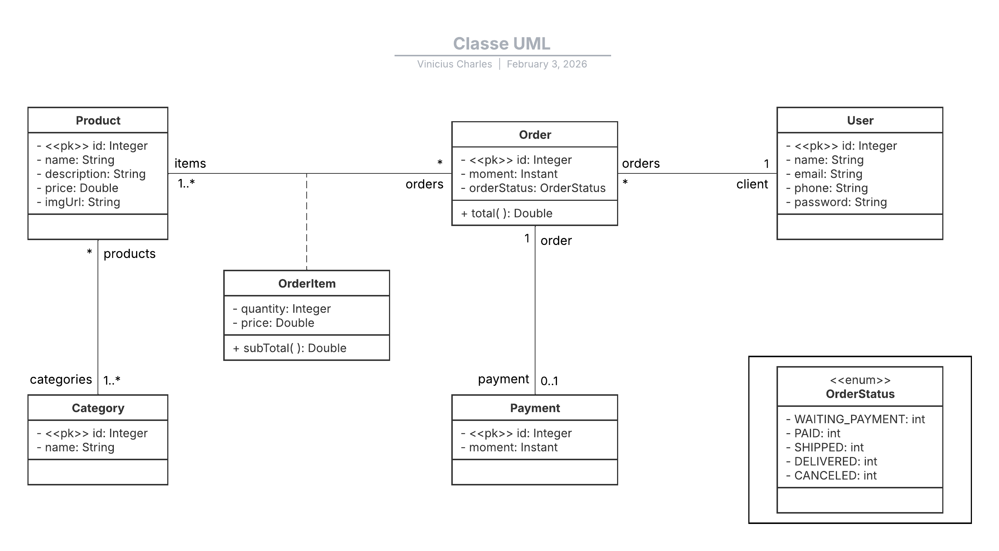

# 📦 Order System API


## Sobre o Projeto

O **Order System** é uma API RESTful completa para gestão de pedidos, desenvolvida utilizando as melhores práticas do ecossistema Spring Boot. O projeto segue uma **Arquitetura em Camadas** para garantir desacoplamento e facilidade de manutenção.

A aplicação gerencia todo o fluxo de um e-commerce simplificado, desde o cadastro de usuários e produtos até a efetivação de pedidos e pagamentos, com tratamento personalizado de erros e validações.

---

## Tecnologias e Ferramentas

* **Java 21** - Linguagem (LTS mais recente).
* **Spring Boot 4** - Framework principal.
* **Spring Data JPA** - Camada de persistência (Hibernate).
* **H2 Database** - Banco em memória para testes e desenvolvimento.
* **PostgreSQL** - Banco de dados de produção (Hospedado no Aiven).
* **Maven** - Gerenciamento de dependências.
* **Docker** - Containerização para deploy.
* **Render** - Plataforma de Cloud Hosting (Deploy Automático).

---

## Arquitetura e Estrutura

O projeto está organizado nos seguintes pacotes principais:

* `config`: Configurações de perfil e instaciação de banco de dados (`TestConfig`).
* `resources`: Controladores REST que expõem os endpoints da API.
* `services`: Camada de lógica de negócios.
* `repositories`: Interfaces de acesso a dados (JPA).
* `entities`: Mapeamento Objeto-Relacional (ORM) das tabelas do banco.
* `exceptions`: Tratamento global de exceções personalizadas.

---

## Modelo Conceitual (Domínio)

Abaixo, o diagrama de classes UML representando as entidades e seus relacionamentos (One-to-Many, Many-to-Many):



### Entidades Principais
* **User**: Cliente do sistema.
* **Order**: Pedido realizado (com Status controlado por Enum).
* **Category** & **Product**: Relacionamento N-N (Muitos para Muitos).
* **OrderItem**: Entidade associativa com chave composta (`OrderItemPK`) para guardar o preço e quantidade no momento da compra.
* **Payment**: Pagamento do pedido (Relacionamento 1-1).

---

## Endpoints da API

A API fornece os seguintes recursos principais:

| Recurso | Método | Endpoint | Descrição |
| :--- | :--- | :--- | :--- |
| **Users** | `GET` | `/users` | Lista todos os usuários |
| | `GET` | `/users/{id}` | Busca usuário por ID |
| | `POST` | `/users` | Cria um novo usuário |
| | `PUT` | `/users/{id}` | Atualiza um usuário |
| | `DELETE` | `/users/{id}` | Remove um usuário |
| **Orders** | `GET` | `/orders` | Lista todos os pedidos |
| | `GET` | `/orders/{id}` | Busca pedido por ID |
| **Products** | `GET` | `/products` | Lista todos os produtos |
| **Categories**| `GET` | `/categories` | Lista todas as categorias |


---

## Tratamento de Erros

A API possui um **Global Exception Handler** (`ResourceExceptionHandler`) que intercepta erros e devolve respostas JSON padronizadas, evitando que stack traces vazem para o cliente.

Exceções personalizadas implementadas:
* `ResourceNotFoundException`: Retorna 404 quando um ID não é encontrado.
* `DatabaseException`: Retorna 400/500 para violações de integridade no banco.

---

## Acesso em Produção

O projeto está rodando online através do Render:

🔗 **Base URL:** `https://ordersystem-vinicius-charles.onrender.com/`

> ⚠️ **Nota Importante:**
> Como esta é uma **API REST** (Back-end) sem interface gráfica (Front-end), ao acessar o link principal acima, você verá uma página de erro 404. **Isso é esperado.**
>
> Para visualizar os dados, utilize os **endpoints** específicos na URL:
> * Listar usuários: `/users` (Ex: https://ordersystem-vinicius-charles.onrender.com/users)
> * Listar pedidos: `/orders`
> * Listar produtos: `/products`

---

## Como Executar Localmente

1.  **Clone o repositório:**
    ```bash
    git clone [https://github.com/V-Charles/ordersystem.git](https://github.com/V-Charles/ordersystem.git)
    ```

2.  **Entre na pasta:**
    ```bash
    cd ordersystem
    ```

3.  **Execute (Perfil Test):**
    ```bash
    mvn spring-boot:run
    ```
    *O perfil de teste irá popular o banco H2 automaticamente.*

4.  **Acesse o Console H2:**
    * URL: `http://localhost:8080/h2-console`
    * JDBC URL: `jdbc:h2:mem:testdb`

---

## 👨‍💻 Autor

**Charles Vinicius**

[](https://www.linkedin.com/in/vinicius-charles/)
[](https://github.com/V-Charles)